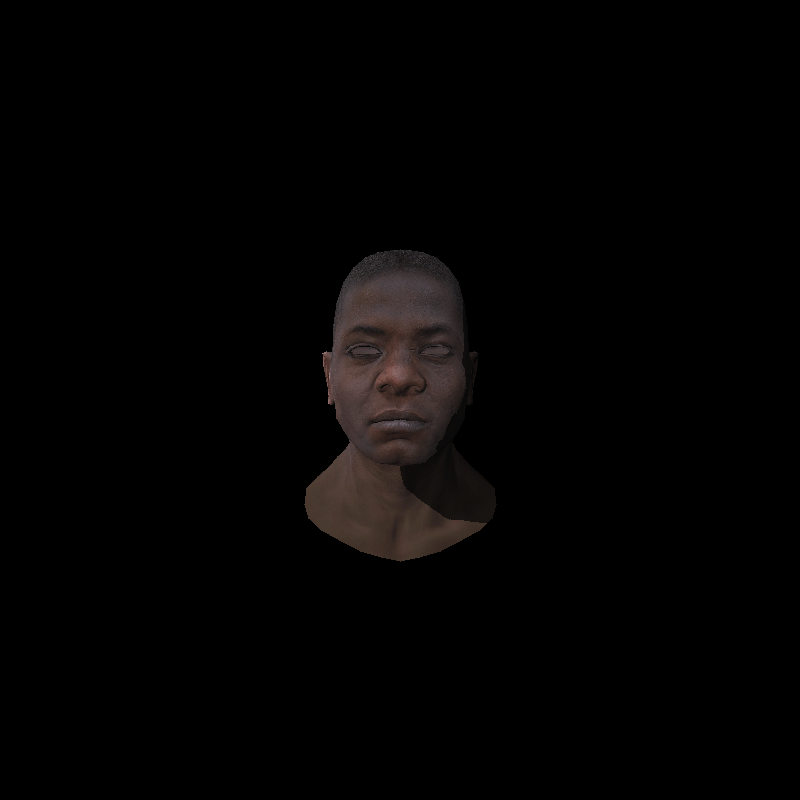

# Software Renderer

A CPU-based 3D renderer built entirely from scratch. No OpenGL, Vulkan, or DirectX.
This project demonstrates a complete graphics pipeline implemented in software, inspired by TinyRenderer, and designed to explore how modern rendering works at the lowest level.

## Overview

This renderer transforms 3D models into shaded 2D images using only C++ and math.
It implements a full custom pipeline, from loading .obj models to rasterizing triangles with depth buffering, shading, and perspective correction.

The goal is to understand and visualize how GPUs work internally by recreating their functionality step-by-step on the CPU.

## Features
- OBJ file loading with vertex, normal, and UV data
- Custom Matrix and Vector math library
- Model, View, Projection, and Viewport transformations
- Triangle rasterization using barycentric coordinates
- Perspective-correct interpolation for attributes
- Depth buffering (Z-buffer) for visibility
- Custom shader interface (similar to GPU vertex/fragment shaders)
- Phong shading with diffuse and specular lighting
- Support for per-vertex and per-fragment shading models
- Texture sampling via UV coordinates
- Diffuse and normal mapping support
- Shadow mapping using a separate depth pass
- Light-space transformations for shadow depth calculation
- Filled triangles (solid shading)
- Wireframe mode for debugging
- Camera control via look-at matrix
- Support for arbitrary world transformations
- Barycentric interpolation optimized for precision
- Configurable resolution and viewport size

## Technical Highlights

Custom Shader System - Implemented as a C++ interface (IShader) that enables flexible material and lighting behaviors, similar to vertex and fragment shaders on the GPU.

Depth Buffer in NDC Space - Full Z-buffer implementation with correct interpolation and screen-space depth mapping.

Shadow Mapping Fix - Adapted TinyRenderer’s inverted transformation approach for accurate shadow lookups across coordinate spaces.

No External Graphics APIs - Rendering output is written directly to a framebuffer and saved as image files (or displayed via a minimal windowing system).

```
Project Structure
/src
├── main.cpp              # Entry point and render loop
├── renderer.h/.cpp       # Core rasterization pipeline
├── shader.h/.cpp         # Shader interface and implementations
├── model.h/.cpp          # OBJ loader
├── geometry.h/.cpp       # Geometry classes
└── framebuffer.h/.cpp    # Output buffer and Z-buffer
/assets
├── model.obj
├── diffuse.tga
├── normal.tga
└── specular.tga
```
## Example Output


## Build Instructions
### Requirements

C++17 or newer compiler

CMake (recommended for cross-platform builds)

CLion using MinGW toolchain
### Build Steps
```bash
git clone https://github.com/iUV-1/software-renderer.git
cd software-renderer
mkdir build && cd build
cmake ..
make
./renderer
```

The output will be saved as an image in /output/ (for example, framebuffer.tga).